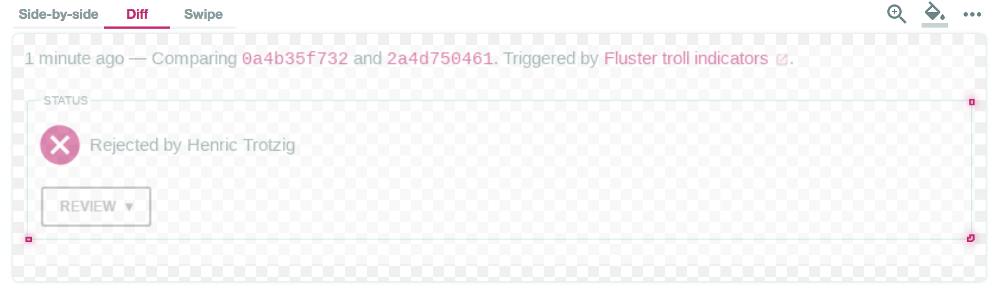

# chrome-spurious-repro
An attempt at creating a repro case for the spurious image diffs we're seeing in Chrome on linux in Happo

## What we're seeing

We use Puppeteer to take screenshots in Chrome for Happo, a screenshot testing
service. We're seeing inconsistently produced screenshots for certain elements
with rounded corners.



This is a diff we're seeing on a component that didn't change its html and css
output/usage.

Raw pngs, as produced by Chrome:


## More information

- This happens on Linux, I've tried both Debian and Centos, same issue
- I haven't been able to repro this in Mac OSX
- The `--disable-gpu` flag does not fix it

## How to run

Use the provided Dockerfile to build an image, then run that image:

```bash
docker build -t "chrome-repro" .
docker run -i -t chrome-repro:latest
```
The output from this command is a list of filenames. If the filenames are all
the same, we're all good. If you see different filenames, we've reproduced the
issue.

This is what I'm seeing when running via docker (for mac):
```
65bfa89f8fd2c5206c249c5953a319f8.png
eae8fa65c444be73981b0bbd838d73c2.png
```

This is what I see when I run `node repro.js` on Mac OSX:

```
65bfa89f8fd2c5206c249c5953a319f8.png
65bfa89f8fd2c5206c249c5953a319f8.png
```

Here's `65bfa89f8fd2c5206c249c5953a319f8.png`:


Here's `eae8fa65c444be73981b0bbd838d73c2.png`:


## Workaround

I found that resetting the full screen to white in between renderings will
force better behavior. See the `workaround` branch in this repo for a
demonstration of that.
